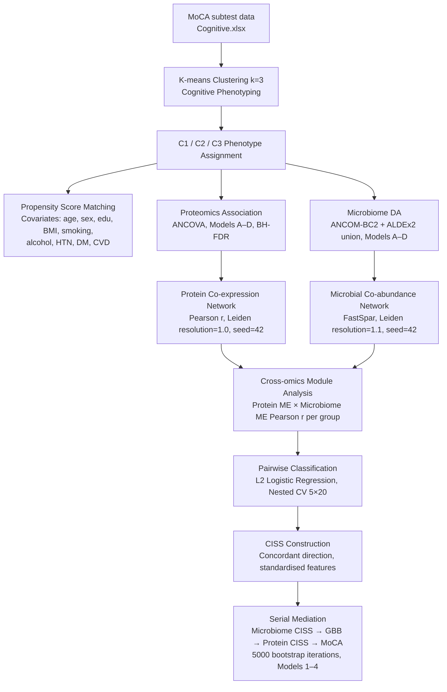

# Systems-Level Integration of Proteomic and Microbiome Networks Reveals Cognitive Decline-Associated Signatures

[](LICENSE)
[]()

## Overview

This repository contains the analysis code used to generate the computational results reported in the manuscript:

> *Authors: to be updated with the manuscript record*  
> *Manuscript in preparation*

The study identified three cognitive phenotypes (C1/C2/C3) in an aging cohort using MoCA subtest profiling, then integrated plasma proteomics, gut microbiome composition, and targeted metabolomics to characterize phenotype-specific multi-omics signatures. The repository includes downstream characterization and analysis of precomputed cognitive phenotype assignments, together with covariate-adjusted omics analyses, network analyses, classification, CISS construction and serial mediation. Note that the original K-means cluster-generation script was not retained; precomputed group assignments (`k-means_3group.csv`) are a required restricted upstream input and are not included in the public repository.

**Participant-level clinical and omics data are not included in this repository.** See [data/README.md](data/README.md) for data access information and input schemas.

---

## Study Workflow



---

## Repository Structure

```
nature_aging_code_release/
├── README.md                       # This file
├── LICENSE                         # MIT License
├── CODE_AVAILABILITY.md            # Nature Portfolio code availability statement
├── MISSING_CODE_REPORT.md          # Inventory of analysis steps without code
├── GITHUB_RELEASE_CHECKLIST.md     # Pre-publication audit checklist
│
├── config/
│   ├── config.example.yaml         # Analysis parameters (copy → config.yaml)
│   └── paths.example.py            # Data paths template (copy → paths.py)
│
├── environment/
│   ├── environment.yml             # Conda environment (Python)
│   ├── requirements.txt            # pip-installable packages
│   └── README.md                   # R and FastSpar installation notes
│
├── data/
│   └── README.md                   # Input data schema; no participant data included
│
├── scripts/
│   ├── 00_microbiome_preprocessing/ # nf-core/ampliseq command and parameters
│   ├── 01_cognitive_phenotyping/    # VIF, Table 1
│   ├── 02_psm_and_microbiome_diversity/ # PSM, alpha diversity, PCoA
│   ├── 03_proteomics_association/   # ANCOVA, Models A–D, BH-FDR
│   ├── 04_microbiome_differential_abundance/ # ANCOM-BC2 + ALDEx2 (R)
│   ├── 05_protein_network/          # Pearson network, Leiden, eigengenes
│   ├── 06_microbial_network/        # Microbial network topology
│   ├── 07_cross_omics_module/        # Cross-omics module analysis scripts
│   ├── 08_classification_and_CISS/  # Nested CV, CISS, feature selection
│   ├── 09_serial_mediation/         # Bootstrap serial mediation
│   └── 10_figure_generation/        # Publication figure scripts
│
├── results/
│   └── README.md                   # Results directory description
│
└── docs/
    ├── MANUSCRIPT_CODE_MAP.md       # Figure → script mapping for reviewers
    ├── FIGURE5_CODE_VALIDATION.md  # Detailed validation of Figure 5
    ├── CISS_CODE_VALIDATION.md     # Detailed validation of CISS construction
    └── SOFTWARE_VERSIONS.md         # All software versions and tool citations
```

---

## Software Requirements

### Python ≥ 3.10

Install via Conda (recommended):

```bash
conda env create -f environment/environment.yml
conda activate nature_aging_multiomics
```

Or via pip:

```bash
pip install -r environment/requirements.txt
```

Key packages: `numpy`, `pandas`, `scipy`, `scikit-learn`, `statsmodels`, `matplotlib`, `seaborn`, `networkx`, `python-igraph`, `leidenalg`, `adjustText`

### R ≥ 4.3

Required for Step 04 (microbiome differential abundance):

```r
BiocManager::install(c("phyloseq", "ANCOMBC", "ALDEx2"))
install.packages(c("tidyverse", "VennDiagram", "emmeans"))
```

### FastSpar

Executed externally on an institutional computing server. Downstream correlation matrices and network topology analysis operate on FastSpar output files. See [scripts/06_microbial_network/README.md](scripts/06_microbial_network/README.md).

---

## Input Data

Participant-level data are **not included**. See [data/README.md](data/README.md) for:
- Complete input file schemas
- Data access contact information

Before running any script, copy `config/paths.example.py` to `config/paths.py` and update `BASE_DIR` to your local data directory.

---

## Reproducing the Analyses

### Step 0 — Upstream Microbiome Preprocessing (External)

Upstream 16S rRNA processing with nf-core/ampliseq v2.11.0 is **executed externally**. See [scripts/00_microbiome_preprocessing/README.md](scripts/00_microbiome_preprocessing/README.md).

### Step 1 — Cognitive Phenotyping

The original K-means cluster-generation script was not retained. The precomputed cluster assignment file (`k-means_3group.csv`) is a required restricted upstream input and is not included in the public repository.

```bash
python scripts/01_cognitive_phenotyping/clinical_collinearity_check.py
python scripts/01_cognitive_phenotyping/clinical_vif_4models.py
python scripts/01_cognitive_phenotyping/generate_table1.py
```

### Step 2 — Propensity Score Matching & Microbiome Diversity

```bash
python scripts/02_psm_and_microbiome_diversity/prepare_microbiome_metadata.py
python scripts/02_psm_and_microbiome_diversity/run_3group_psm.py
python scripts/10_figure_generation/plot_alpha_diversity.py
python scripts/10_figure_generation/plot_bray_curtis_pcoa.py
```

### Step 3 — Proteomics Association Analysis

```bash
python scripts/03_proteomics_association/run_covariate_models.py
```

Runs Models A–D (Main, Systemic, Statin, Medication sensitivity) and generates omnibus F-test results, BH-FDR q-values, and adjusted marginal means.

### Step 4 — Microbiome Differential Abundance

```bash
Rscript scripts/04_microbiome_differential_abundance/run_microbiome_covariate_models.R
```

Runs ANCOM-BC2 + ALDEx2 for Models A–D.

### Step 5 — Protein Co-expression Network

```bash
python scripts/05_protein_network/run_proteomics_network_analysis.py
```

Builds group-specific Pearson correlation networks, runs Leiden clustering, and computes module eigengenes.

### Step 6 — Microbial Co-abundance Network

```bash
python scripts/06_microbial_network/analyze_network_topology.py
```

Operates on FastSpar output matrices to perform topology analysis and Leiden community detection.

### Step 7 — Cross-omics Module Analysis

```bash
python scripts/10_figure_generation/plot_me_moca_correlation.py
```

### Step 8 — Pairwise Classification & CISS Construction

```bash
# Pairwise logistic regression classification & Supplementary Table 5
python scripts/08_classification_and_CISS/clinical_vs_omics_feature.py

# Final Cognitive Impairment Signature Score (CISS) construction
python scripts/08_classification_and_CISS/feature_ratio_modeling_cont_clin.py

# Companion visualization for CISS group boxplots and MoCA correlations
python scripts/08_classification_and_CISS/plot_ciss_boxplot_moca_correlation.py
```

### Step 9 — Serial Mediation Analysis

```bash
python scripts/09_serial_mediation/sequential_mediation.py
```

Runs forward (Microbiome CISS → GBB → Protein CISS → MoCA) and reverse models with 5,000 bootstrap iterations.

### Step 10 — Figure Generation

Individual figure scripts are in `scripts/10_figure_generation/`. See [docs/MANUSCRIPT_CODE_MAP.md](docs/MANUSCRIPT_CODE_MAP.md) for the Figure → script mapping.

---

## Manuscript Figures & Tables Mapping

### Main Figures

| Figure | Description | Primary Script / Source |
|--------|-------------|------------------------|
| **Fig. 1** | Study design / workflow | Conceptual diagram |
| **Fig. 2a** | PCA of cognitive features | `scripts/10_figure_generation/plot_pca_cognitive.py` |
| **Fig. 2b** | Total MoCA score boxplot | `scripts/10_figure_generation/plot_moca_boxplot.py` |
| **Fig. 2c** | MoCA subtests pairwise comparisons | `scripts/10_figure_generation/plot_moca_group_comparisons.py` |
| **Fig. 2d** | Phylum alpha diversity | `scripts/10_figure_generation/plot_alpha_diversity.py` |
| **Fig. 2e** | Genus alpha diversity | `scripts/10_figure_generation/plot_alpha_diversity.py` |
| **Fig. 2f** | Full-cohort Bray-Curtis PCoA | `scripts/10_figure_generation/plot_bray_curtis_pcoa.py` |
| **Fig. 2g** | PSM phylum alpha diversity | `scripts/02_psm_and_microbiome_diversity/plot_bray_curtis_pcoa_psm.py` |
| **Fig. 2h** | PSM genus alpha diversity | `scripts/02_psm_and_microbiome_diversity/plot_bray_curtis_pcoa_psm.py` |
| **Fig. 2i** | PSM Bray-Curtis PCoA | `scripts/02_psm_and_microbiome_diversity/plot_bray_curtis_pcoa_psm.py` |
| **Fig. 3a** | Proteomics forest plot | `scripts/03_proteomics_association/run_covariate_models.py` |
| **Fig. 3b** | Proteomics model overlap | `scripts/10_figure_generation/plot_venn_ABCD_labeled.py` |
| **Fig. 3c** | Proteomics P-value trajectories | `scripts/03_proteomics_association/run_covariate_models.py` |
| **Fig. 3d** | Microbiome forest plot | `scripts/04_microbiome_differential_abundance/run_microbiome_covariate_models.R` |
| **Fig. 3e** | Microbiome model overlap | `scripts/10_figure_generation/plot_venn_ABCD_labeled.py` |
| **Fig. 3f** | C2 vs C1 microbial P-value trajectories | `scripts/04_microbiome_differential_abundance/run_microbiome_covariate_models.R` |
| **Fig. 3g** | C3 vs C1 microbial P-value trajectories | `scripts/04_microbiome_differential_abundance/run_microbiome_covariate_models.R` |
| **Fig. 4a** | Protein networks | `scripts/05_protein_network/run_proteomics_network_analysis.py` |
| **Fig. 4b** | Microbial networks | `scripts/06_microbial_network/analyze_network_topology.py` |
| **Fig. 4c** | Protein module eigengene scores | `scripts/10_figure_generation/plot_proteomics_modules.py` |
| **Fig. 4d** | Microbial module eigengene scores | `scripts/10_figure_generation/plot_leiden_24_taxa.py` |
| **Fig. 4e** | Cross-omics ME×ME correlations | UNRESOLVED (rendering script not located) |
| **Fig. 5a** | C1 vs C2 classification performance | `scripts/08_classification_and_CISS/clinical_vs_omics_feature.py` |
| **Fig. 5b** | C1 vs C3 classification performance | `scripts/08_classification_and_CISS/clinical_vs_omics_feature.py` |
| **Fig. 5c** | Coefficient concordance across C1 vs C2 and C1 vs C3 | `scripts/08_classification_and_CISS/feature_ratio_modeling_cont_clin.py` |
| **Fig. 5d** | Domain-specific CISS across C1/C2/C3 | `scripts/08_classification_and_CISS/feature_ratio_modeling_cont_clin.py` & `plot_ciss_boxplot_moca_correlation.py` |
| **Fig. 5e** | Microbiome CISS × Proteomic CISS landscape with MoCA Z-score | `scripts/08_classification_and_CISS/feature_ratio_modeling_cont_clin.py` (exports `sample_ratio_features.csv` expected output; rendering script unresolved) |
| **Fig. 5f** | CISS vs total MoCA Spearman correlations | `scripts/08_classification_and_CISS/plot_ciss_boxplot_moca_correlation.py` (`ratio_moca_spearman.csv`) |
| **Fig. 6a** | CISS × targeted metabolite heatmap | `scripts/10_figure_generation/plot_metabolite_violins_heatmap_v2.py` |
| **Fig. 6b** | Mediation robustness Models 1–4 | `scripts/10_figure_generation/plot_mediation_sensitivity_forest.py` |
| **Fig. 6c** | Forward mediation | `scripts/09_serial_mediation/sequential_mediation.py` |
| **Fig. 6d** | Reverse mediation | `scripts/09_serial_mediation/sequential_mediation.py` |

### Supplementary Tables

| Table | Description | Primary Script |
|-------|-------------|----------------|
| **Supp. Table 1** | Full-cohort baseline characteristics | `scripts/01_cognitive_phenotyping/generate_table1.py` |
| **Supp. Table 2** | PSM baseline characteristics | `scripts/02_psm_and_microbiome_diversity/generate_psm_table1.py` |
| **Supp. Table 3** | Proteomic network topology metrics | `scripts/03_proteomics_association/analyze_proteomics_topology.py` |
| **Supp. Table 4** | Microbial network topology metrics | `scripts/06_microbial_network/analyze_network_topology.py` |
| **Supp. Table 5** | Classification performance metrics | `scripts/08_classification_and_CISS/clinical_vs_omics_feature.py` |

---

## Data Availability

This code repository does **not** constitute a data repository.
Participant-level proteomics, microbiome, and clinical data from this study are not deposited in a public repository due to IRB and participant privacy restrictions.
Researchers wishing to access the data should contact the corresponding author. Data sharing is subject to institutional data use agreements.

---

## License

See [LICENSE](LICENSE).
